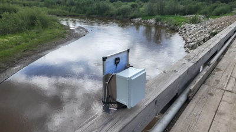
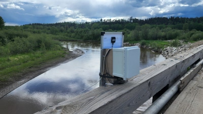
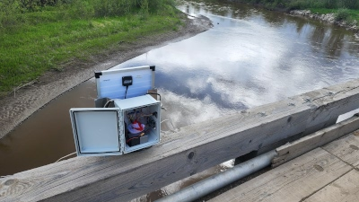
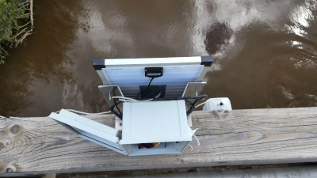
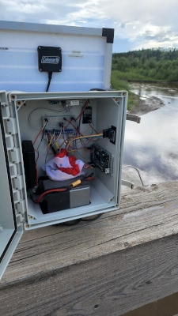
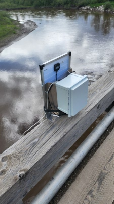
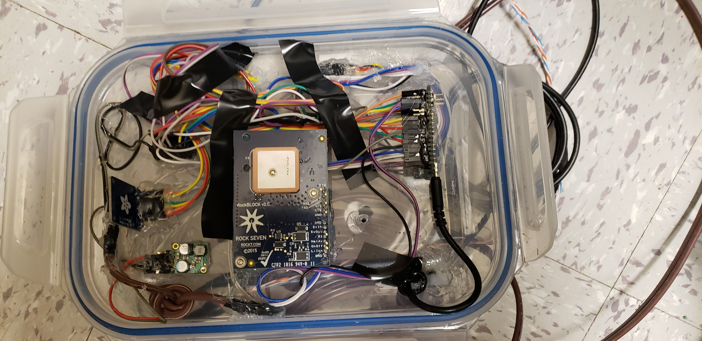
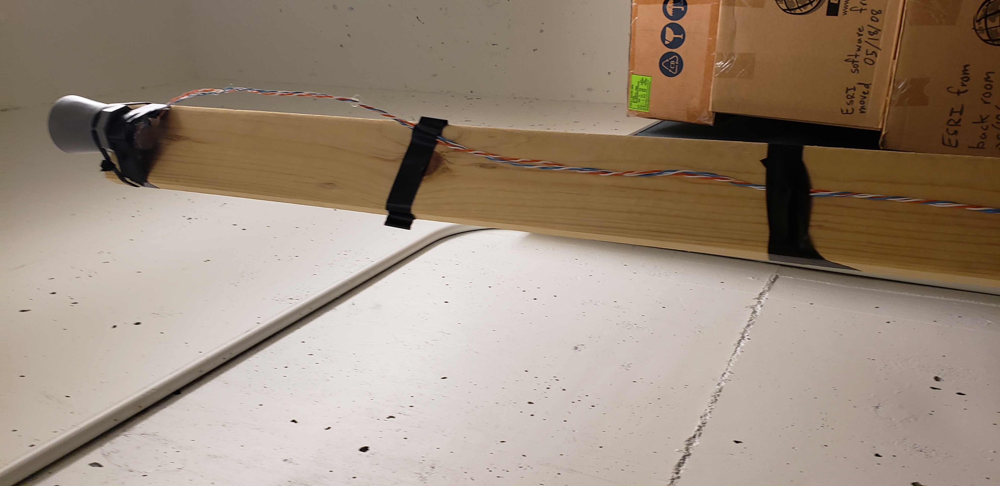

# DistributedWaterLevelMonitor
Python Application for monitoring waterlevel at provincial scale

* Installation:
Install PostgreSQL and create a database and user, add login credentials to passwd.cred

* Add new deployment:
Use the script addDeployment.py, setting the IMEI, Location and Mounting Height, lines 5-7

# The Project
This project is being developed as part of a collaboration between the the UNBC GIS Lab and the BC Ministry of Forests, Lands, and Natural Resources. The purpose of this project is to develop a low cost distributed sensor network for monitoring water levels and flood events across the province. 

The individual stations communicate via RockBLOCK satillite modems using the Iridium constellation, and are built using Arduino microcontrollers. By leveraging satellite communication, and low power monitoring tools, it is made practical to deploy sensors in locations without existing cellular or radio infrastructure, and where it may be expensive for crews to access on a regular basis.

By placing all the data into a central database, there are options opened for correlating measurements across watersheds, and viewing the same watercourse at different points.

## The Station
The station is built using an Arduino Mega. The Mega is the recommended board as it contains sufficient storage space for SD card Library for more frequent logging).

### Features

* Capable of reading a variety of measurements: air temperature, water temperature, air pressure, humidity, water depth.
* The station sends data via satellite – 4 readings every 6 hours by default which gets captured to the web server.
   * Easily tuned by modifying paramaters in the Arduino code.
   * While the satellite module can only send 4 readings per transmission, the station is also capable of taking more frequent
     readings and saving them to an SD Card.
   * For example, a measurement can be taken every 15 minutes and saved to the SD Card. The measurements at 90 minutes,
     180 minutes, 270 minutes, and 360 minutes would be sent to the web server.
* Low-power device – uses a real-time clock (RTC) with an interrupt to bring the Arduino to a lower power sleep between readings—ideal for solar power.

### Sensors & Hardware

The station makes use of the following sensors. 
* **MaxBotix MB7052-100 Ultrasonic Range Finder** – for water level monitoring
* **Adafruit DS18B20** – sensors for water temperature monitoring
* **Adafruit BME280** – sensors for weather monitoring (Temperature, Humidity, Pressure)
* **RockBLOCK 19354** – satellite module data transmission
* **Adafuit Micro-SD Breakout+** – data logging
* **PCF 8523** – real time clock (RTC)
* Power is provided by a compact lead-acid battery, a 6-36v to 5v voltage regulator, hooked up to a solar panel.

### Pins

[//]: # (Talk about the pins, maybe have a photo of the Arduino board? Maybe trace the wires in the picture? I don't know how I want to do this yet.)

| Sensor                                  | Pins                                                                         | Information                                                                             |
| --------------------------------------- | ---------------------------------------------------------------------------- | --------------------------------------------------------------------------------------- |
| Sonar Sensor: MaxBotix MB7052-100       | Data (Pin 4)                                                                 | https://www.maxbotix.com/articles/095.htm                                               |
| RTC: PCF 8523                           | SDA (Pin 20), SCL (Pin 21), Wake(Pin 3)                                      | https://learn.adafruit.com/adafruit-pcf8523-real-time-clock/rtc-with-arduino            |
| SD-Card: Adafruit Micro-SD Breakout+    | MISO (Pin 50), MOSI (Pin 51), SCK (Pin 52), CS (Pin 53), Card Detect (Pin 6) | https://learn.adafruit.com/adafruit-micro-sd-breakout-board-card-tutorial/introduction  |
| Water Temp: Adafruit DS18B20            | Pin 5                                                                        | https://www.adafruit.com/product/381                                                    |
| Climate Data: Adafruit BME280           | SCK (Pin 52), SDO(Pin 50), SDI (Pin 51), CS(Pin 49)                                | https://www.adafruit.com/product/2652                                                   |
| Communication: RockBLOCK 19354          | Sleep (Pin 2), TX (Pin 18), RX (Pin 19)                                      | https://github.com/mikalhart/IridiumSBD, http://arduiniana.org/libraries/iridiumsbd/    |

### Wiring

#### Water Temp: Adafruit DS18B20
* Sensor end terminates in a Male 3-pin connector
* The wire connected to the box terminates with a Female 3-pin connector
* The male/female ends of the water temperature sensor are opposite of the sonar sensor to prevent the wrong sensor from being connected.

| Sensor End - Male            | Station End - Female         |
| ---------------------------- | ---------------------------- |
| Red                          | Red                          |
| Blue                         | Black                        |
| Yellow                       | White                        |

#### MaxBotix MB7052-100
* Sensor part terminates in a Female 3-pin connector
* The wire coming from the box terminates in a Male 3-pin connector.
* The male/female end are opposite of of the water temperature sensor to prevent the wrong sensor from being connected.
* It's also good to consider soldering additional wire(s) to the sonar sensor. The main reason for this is to prevent weak solder joints from breaking off. The more wires soldered to the sensor, the more it should hopefully resist a greater degree of accidental twisting or pulling.

| Sensor End - Female          | Station End - Male           |
| ---------------------------- | ---------------------------- |
| Vin                          | Red                          |
| Ground                       | Black                        |
| Pin 2                        | White                        |

#### BME280 Climate Sensor
The BME280 climate sensor uses a 6-pin connector.
The sensor has the male end.
The connector coming from the weather station has the female end.

| Sensor End - Male            | Station End - Fenale         |
| ---------------------------- | ---------------------------- |
| Ground                       | Ground                       |
| Vin                          | Black                        |
| SCK                          | Yellow                       |
| SDO                          | Blue                         |
| SDI                          | Red                          |
| CS                           | Green                        |

#### Solar Panel
The solar panel uses a 2-wire barrel conector.
The solar panel connection has the male end.
The connector coming from the weather station has the female end, this ends up going to .
The wiring is fairly straightforward.

| Panel End                    | Station End                  |
| ---------------------------- | ---------------------------- |
| Red                          | Red                          |
| Black                        | Black                        |

#### Battery
The battery has a 2-wire barrel jack going to the Arduino.
The battery has a 2-wire barrel jack going to the solar panel charge controller.

| Panel End                    | Station End                  |
| ---------------------------- | ---------------------------- |
| Red                          | Red                          |
| Black                        | Black                        |

### Gallery

[//]: # (The station is constructed inside of a reusable sealing food container, all components were hot glued to the lid of the container and then cables for external sensors were run through holes and sealed with silicon.)

The station is constructed inside of a [Fibox ARCA type weatherproof enclosure](https://www.fibox.com/products/ARCA-IEC/ARCA-504021). All components are secured via VELCRO Industrial Strength fasteners, providing a degree of shock absorption. We are using marine grade shrink tubing on some of the components with a 3:1 shrink ratio and an internal adhesive, which ensures a watertight seal on any cable joints.

[//]: # (The water level sensor was attached to a 1x4, which was in tern screwed to the side of a bridge holding it at a steady position above the water.)

First Deployment:

## The Webserver
  The webserver is built using Python Flask and PostgreSQL, and is designed to provide an easy to use view of the data collected by the sensors. 
  

The webserver exposes the following endpoints
 * http://<domain>/rockblock this is the URL used to add data, and should only be called by the RockBlock api, it takes the following information: imei, momsn, transmit_time, iridium_latitude, iridium_longitude, iridum_cep, payload 
  * http://<domain>/deployments returns a JSON list of all current and past deployments with their locations and dates of use
  * http://<domain>/resutls?deployment=<id> Returns a JSON list of all results recorded by deployment id, the deployment id can be determined from http://<domain>/deployments
  * http://<domain>/graph?deployment=<id> Returns a graphical representation of results
  * still under development is a map that will show all deployments, clicking on pins in the map will allow linking to the graph page for the deployment in question.
